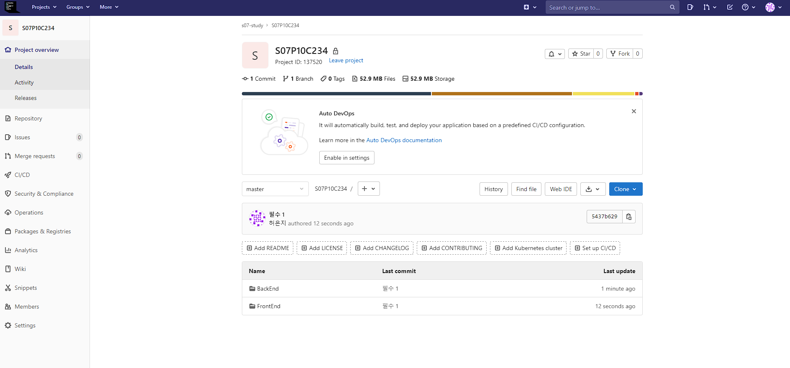
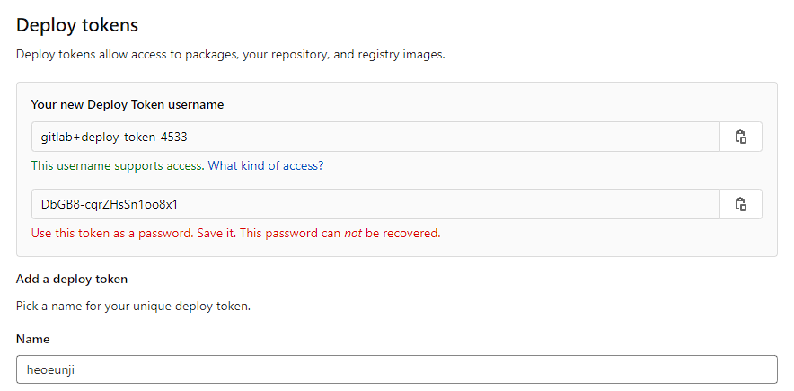
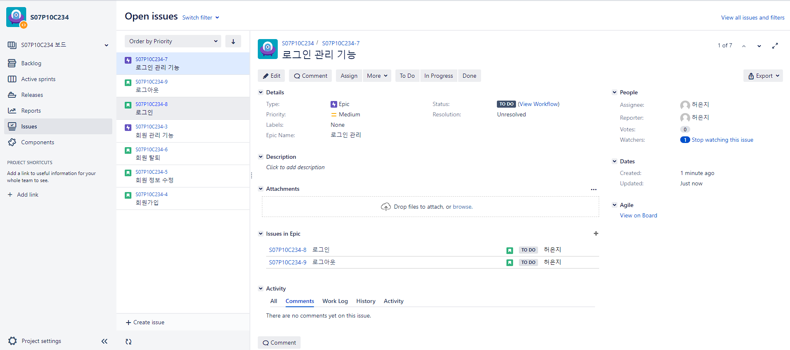
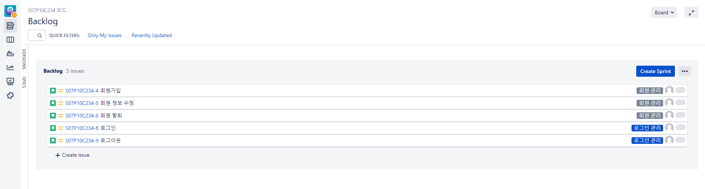
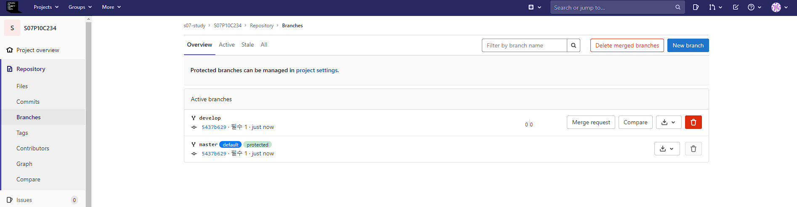
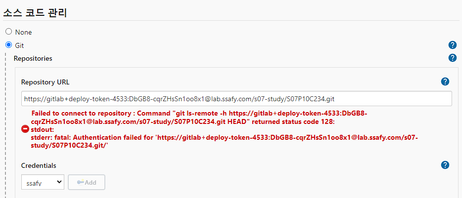
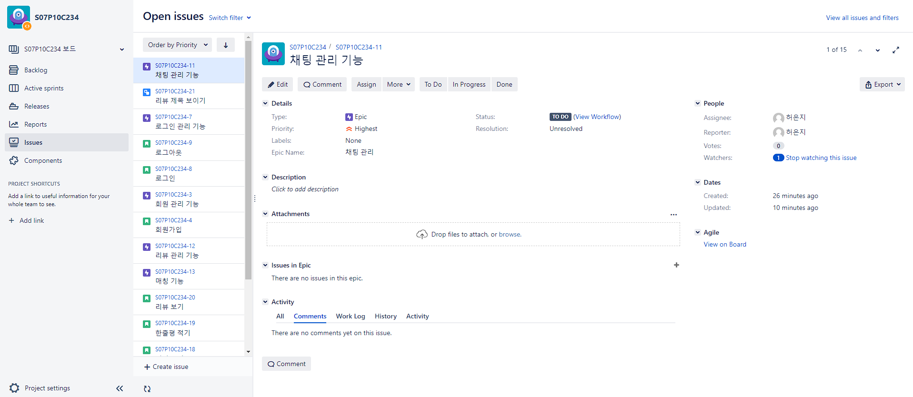
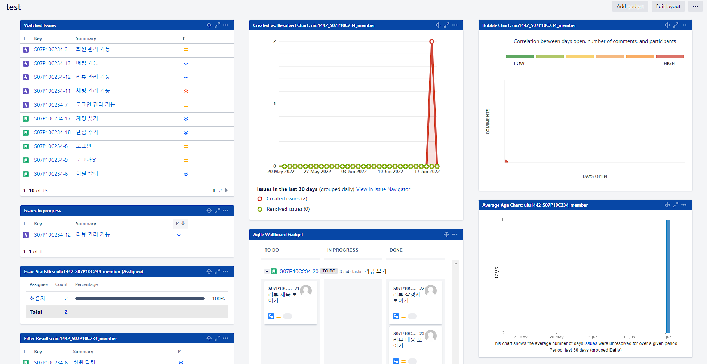
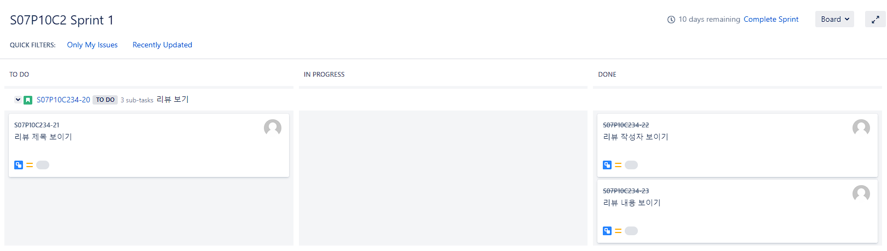

# 필수 1. 1학기와 2학기 차이 및 SSAFY GIT 실습

## JIRA란?

- Atlassian에서 제공하는 이슈 관리 소프트웨어
- 이슈와 스프린트, 스크럼 보드 제공 등 이슈로 정의할 수 있는 개발 항목(기능, 작업 단위, 버그 등)을 관리
- 애자일 프로세스 기반

| Issue Type| 설명                                                         | 예시                                     |
| --------- | ------------------------------------------------------------ | --------------------------------------- |
| Epic      | 최상위수준 기능/작업단위 (프로젝트 전반 또는 여러 Sprint에 걸쳐 진행할 정도의 범위) | 회원 관리, 로그인 관리|
| Story     | Epic에 대한 하위 Level 수준의 기능/작업단위                  | 회원 가입, 회원 정보 수정 등                 |
| Bug       | 프로젝트 개발/검증 중 발견된 버그                            | 상품 검색 시 특정 상품이 조회되지 않는 문제   |
| Task      | 개발에 직접 해당되지는 않으나 Sprint안에 포함해 해야 할 일   | ERD 작성, 테스트케이스 작성                   |
| Sub-task  | 위 Issue들과 관련하여 세부 단위 작업 등이 필요할 때 등록     |                                             |

## Jenkins란?

- CI(지속적인 통합)과 CD(지속적인 배포)를 제공하는 도구
- 빌드 문제가 야기된 시점을 찾기 위해 빌드를 자동화
- Git 저장소에 업로드된 소스 코드는 Jenkins와의 연동을 통해 빌드 및 배포 단계까지 자동으로 진행

## Git 설정

- Jira 프로젝트 생성
- gitlab 생성

- gitlab deploy token 등록

- Jenkins 등록
- db 생성

## 이슈 관리

- 이슈 등록
  - Depth 1: Epic으로 등록
  - Depth 2: Story로 등록하되 해당되는 Epic에 연결 지정

## 소스 코드 관리

- 소스 코드 업로드
- develop 브랜치 생성

- readme.md 파일 작성

## 빌드 관리
- 에러 떠서 포기......

# 선택 14. JIRA 활용

- JIRA Project url
https://jira.ssafy.com/projects/S07P10C234/summary

- Filter url
https://jira.ssafy.com/browse/S07P10C234-6?filter=23960

- Dashboard url
https://jira.ssafy.com/secure/Dashboard.jspa?selectPageId=11517

- Sprints

